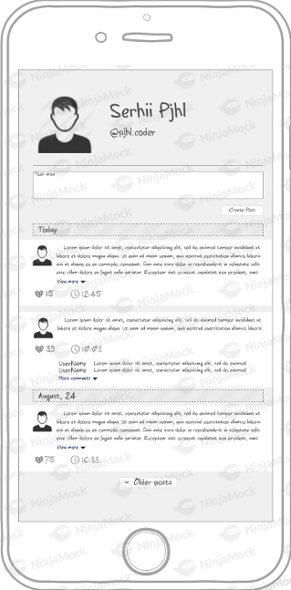

# Graphql-demo

This application is a simple personal user page like facebook posts.



Features:

* User can add post
* List of 10 posts per page, next posts can be loaded with button "Load more"
* Users can to like own and anothers posts
* Everyone can see the likes
* Users can write coments


## Start

```bash
docker-compose up --build
```

Entrypoints:

* Backend graphql: `http://localhost:8081/graphql`
* Frontend: `http://localhost:8080`
